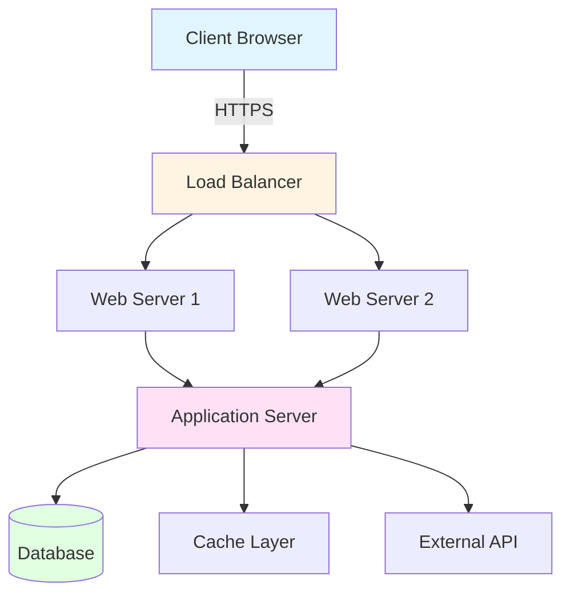
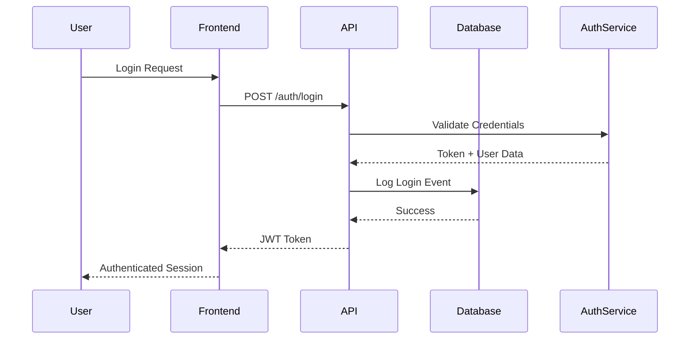
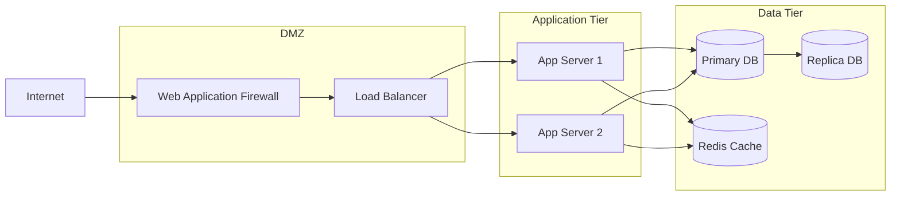
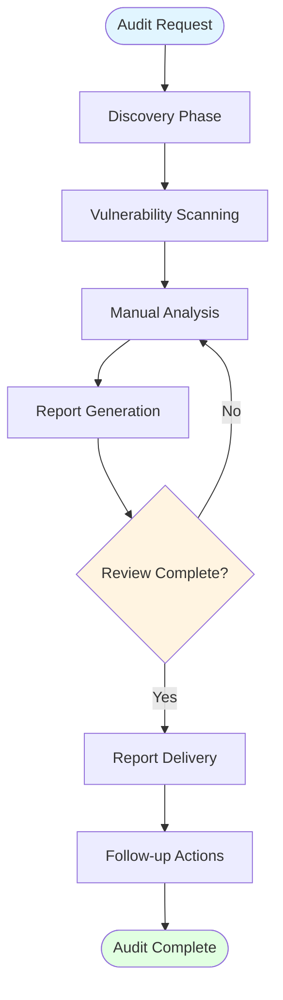

# Security Audit Report - Example

This is a comprehensive example demonstrating all markdown features supported in the audit report preview.

## Executive Summary

This report provides a **detailed analysis** of the security posture of the application. The audit was conducted using industry-standard methodologies and tools.

### Key Findings

- **Critical Issues**: 3
- **High Priority**: 7
- **Medium Priority**: 12
- **Low Priority**: 5

## Architecture Overview

The following diagram illustrates the system architecture:



## Code Examples

### JavaScript Example

Here's an example of vulnerable code that was identified:

```javascript
// VULNERABLE: SQL Injection risk
function getUserData(userId) {
    const query = `SELECT * FROM users WHERE id = ${userId}`;
    return database.query(query);
}

// SECURE: Parameterized query
function getUserDataSecure(userId) {
    const query = 'SELECT * FROM users WHERE id = ?';
    return database.query(query, [userId]);
}
```

### Python Example

```python
import hashlib
import secrets

# VULNERABLE: Weak password hashing
def hash_password(password):
    return hashlib.md5(password.encode()).hexdigest()

# SECURE: Using bcrypt
import bcrypt

def hash_password_secure(password):
    salt = bcrypt.gensalt()
    return bcrypt.hashpw(password.encode(), salt)
```

### SQL Example

```sql
-- Example of a secure query with proper parameterization
SELECT 
    u.id,
    u.email,
    u.created_at,
    COUNT(o.id) as order_count
FROM users u
LEFT JOIN orders o ON u.id = o.user_id
WHERE u.status = 'active'
GROUP BY u.id
HAVING COUNT(o.id) > 0
ORDER BY u.created_at DESC
LIMIT 10;
```

## Data Flow Diagram



## Security Issues Table

| Severity | Issue ID | Description | Affected Component | Status |
|----------|----------|-------------|-------------------|--------|
| Critical | SEC-001 | SQL Injection in user search | User Management API | Open |
| Critical | SEC-002 | Missing authentication on admin endpoint | Admin Panel | Open |
| Critical | SEC-003 | Sensitive data in logs | Logging Service | Open |
| High | SEC-004 | Weak password policy | Authentication Service | In Progress |
| High | SEC-005 | Missing CSRF protection | Web Forms | Open |
| High | SEC-006 | Insecure session management | Session Handler | Open |
| Medium | SEC-007 | Missing rate limiting | API Gateway | Open |
| Medium | SEC-008 | Insecure file upload | File Service | Open |

## Recommendations

### Priority 1: Critical Issues

1. **Implement Parameterized Queries**
   - Replace all string concatenation in SQL queries
   - Use ORM query builders where possible
   - Audit all database access points

2. **Add Authentication Middleware**
   - Implement JWT token validation
   - Add role-based access control (RBAC)
   - Enable multi-factor authentication for admin accounts

3. **Sanitize Log Output**
   - Remove sensitive data before logging
   - Implement log filtering rules
   - Use structured logging with field masking

### Priority 2: High Priority Issues

> **Note**: These issues should be addressed within 30 days to maintain compliance with security standards.

- Implement password complexity requirements
- Add CSRF tokens to all forms
- Review and strengthen session management

## Network Topology



## Testing Checklist

- [x] Authentication bypass testing
- [x] Authorization testing
- [x] Input validation testing
- [x] SQL injection testing
- [x] XSS vulnerability testing
- [ ] CSRF protection testing
- [ ] Session management testing
- [ ] File upload security testing
- [ ] API rate limiting testing
- [ ] Encryption at rest testing

## Code Snippets

### Inline Code Example

Use `bcrypt.compare()` for password verification, not plain text comparison.

### Multiple Languages

**Bash Script:**
```bash
#!/bin/bash
# Security scan script
for file in $(find . -name "*.js"); do
    echo "Scanning $file"
    grep -n "eval\|innerHTML\|dangerouslySetInnerHTML" "$file"
done
```

**JSON Configuration:**
```json
{
  "security": {
    "jwt": {
      "secret": "${JWT_SECRET}",
      "expiresIn": "24h"
    },
    "cors": {
      "origin": ["https://example.com"],
      "credentials": true
    }
  }
}
```

**YAML Config:**
```yaml
security:
  rate_limiting:
    enabled: true
    max_requests: 100
    window_minutes: 15
  encryption:
    algorithm: AES-256-GCM
    key_rotation_days: 90
```

## Process Flow



## Additional Notes

### Blockquote Example

> "Security is not a product, but a process." - Bruce Schneier
> 
> This audit represents a snapshot in time. Continuous security monitoring is recommended.

### Links

- [OWASP Top 10](https://owasp.org/www-project-top-ten/)
- [Security Best Practices](https://example.com/security-guide)
- [Compliance Standards](https://example.com/compliance)

### Emphasis Examples

- **Bold text** for important information
- *Italic text* for emphasis
- ***Bold and italic*** for strong emphasis
- `Code` in paragraphs
- ~~Strikethrough~~ for deprecated items

---

## Conclusion

This audit has identified several areas requiring immediate attention. The recommended actions should be prioritized based on severity and business impact.

For questions or clarifications, please contact the security team.

---

*Report generated on: 2026-01-25*  
*Next review scheduled: 2026-04-25*
